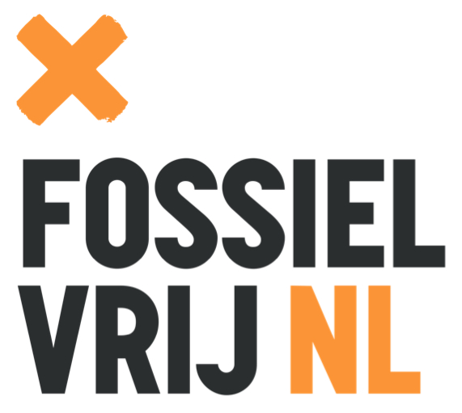
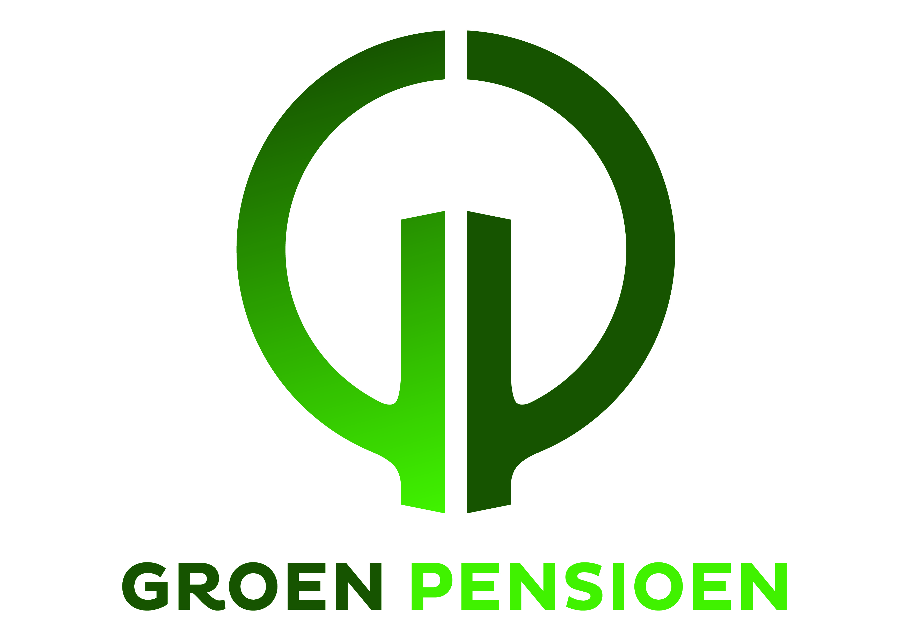
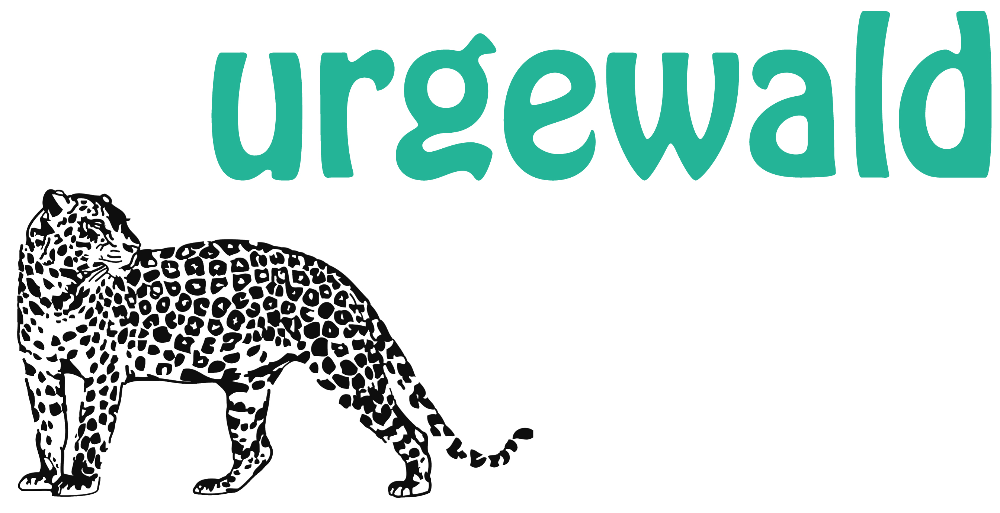

# Fossielvrij NL & Groen Pensioen software repository

Scripts for analysing investment data from pension funds and other financial institutes.

This is work in progress. Also the documentation is in progress. Check back later, or feel free to submit an issue to ask questions!

## What does this software do?

This collection of scripts was created to:

* Monitor the investment lists that pension funds publish on their websites
* Download their investment data
* Join recent investment data with a previous list to see changes
* Convert the investment lists to TSV (tab separated values) which can be easily imported into Excel
* Match investment lists with the GOGEL (Global Oil and Gas Exit List) and GCEL (Global Coal Exit List) lists.

## How is it organised?

* abp: scripts for and data of Dutch pension fund ABP
* common: scripts that are common for every institute
* gogel-urgewald: the lists of fossil companies on the GOGEL and GCEL lists, and scripts to match them with investment lists.
* pfzw: scripts for and data of Dutch pension fund PFZW
* pno-media: scripts for and data of Dutch pension fund PNO Media
* sph: scripts for and data of Dutch pension fund SPH

## How do I use it?

ToDo

## Credits

This software was created for Dutch NGOs [Fossielvrij NL](https://gofossilfree.org/nl/) and [Groen Pensioen](https://goed-pensioen.nl/), with courtesy of German NGO [Urgewald](https://www.urgewald.org/) for the use of their awesome GOGEL and GCEL.

    
    
    

